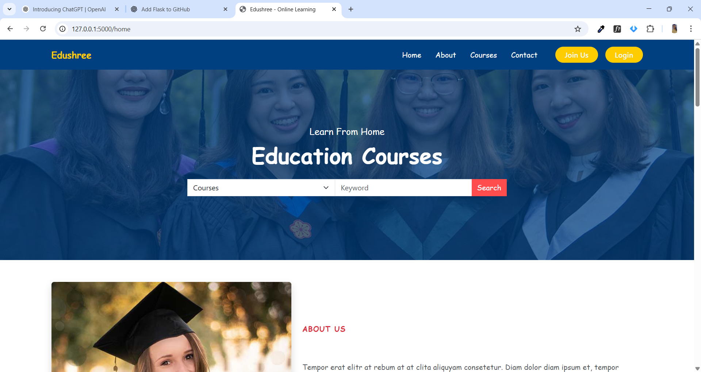
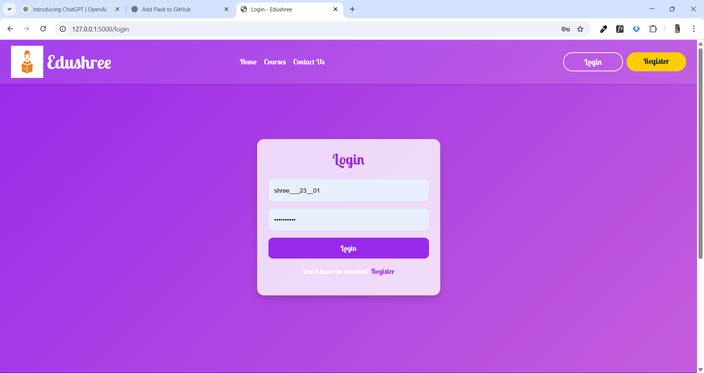
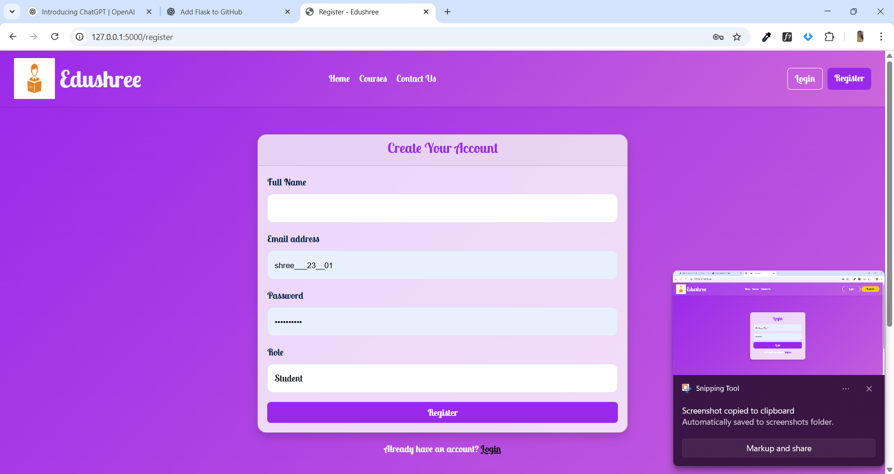

# 🎓 Online Learning Platform (Flask)

A fully functional **Online Learning Web Application** developed using **Flask (Python)**, **MySQL**, and modern **HTML, CSS, Bootstrap, and JavaScript**. This platform allows students to register, log in, browse courses, and access learning content, while admins can manage users and courses.

---

## 🚀 Features

* User Registration & Login (Authentication System)
* Role-based Dashboard (Student / Admin)
* Course Listing & Enrollment
* Responsive UI using Bootstrap
* Secure Password Storage
* MySQL Database Integration
* Modular Flask Project Structure

---

## 🛠️ Tech Stack

| Layer           | Technology                       |
| --------------- | -------------------------------- |
| Backend         | Flask (Python)                   |
| Frontend        | HTML, CSS, Bootstrap, JavaScript |
| Database        | MySQL                            |
| Styling         | Bootstrap + Custom CSS           |
| Version Control | Git & GitHub                     |

---

## 📸 Screenshots

> Create a folder named **screenshots/** in the project root and place your screenshots inside.

### 🏠 Home Page



### 🔐 Login Page



### 📝 Register Page



---

## 🎬 Live Demo  
(https://www.youtube.com/watch?v=TerFRnFNaGg&t=136s)

---


## 📂 Project Structure

```
Project/
│ app.py
│ requirements.txt
│ README.md
│
├── templates/
│     ├── home.html
│     ├── login.html
│     ├── register.html
│     ├── dashboard.html
│
├── static/
│     ├── css/
│     ├── js/
│     └── images/
│
└── migrations/
```

---

## ⚙️ Installation & Setup

### 1️⃣ Clone the Repository

```
git clone https://github.com/yourusername/Online-Learning-Platform-Flask.git
cd Online-Learning-Platform-Flask
```

### 2️⃣ Create Virtual Environment

```
python -m venv venv
```

### 3️⃣ Activate Virtual Environment

* Windows:

```
venv\Scripts\activate
```

* Linux/Mac:

```
source venv/bin/activate
```

### 4️⃣ Install Dependencies

```
pip install -r requirements.txt
```

### 5️⃣ Configure Database

* Start MySQL Server
* Create Database:

```
CREATE DATABASE online_learning;
```

* Update `app.py` DB credentials if required

### 6️⃣ Run the Application

```
python app.py
```

Open in Browser:

```
http://127.0.0.1:5000/
```

---

## 👤 Author

**Shreya Kathoke**
Full Stack Developer

---

## 🤝 Contributing

Pull requests are welcome! If proposing major changes, please open an issue first to discuss your ideas.

---

## ⭐ Show Your Support

If you like this project, please give it a star ⭐ on GitHub! Thank you! 🙌

